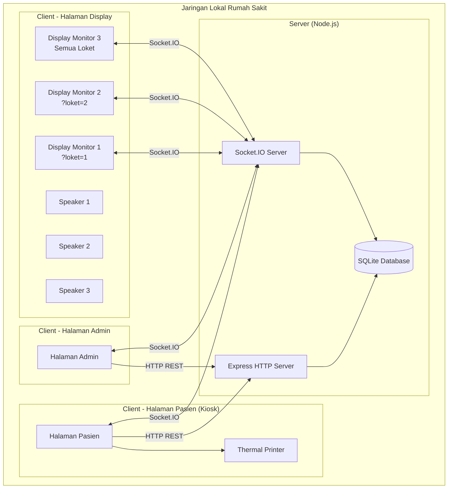
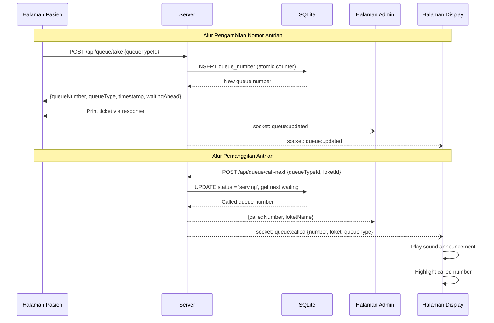
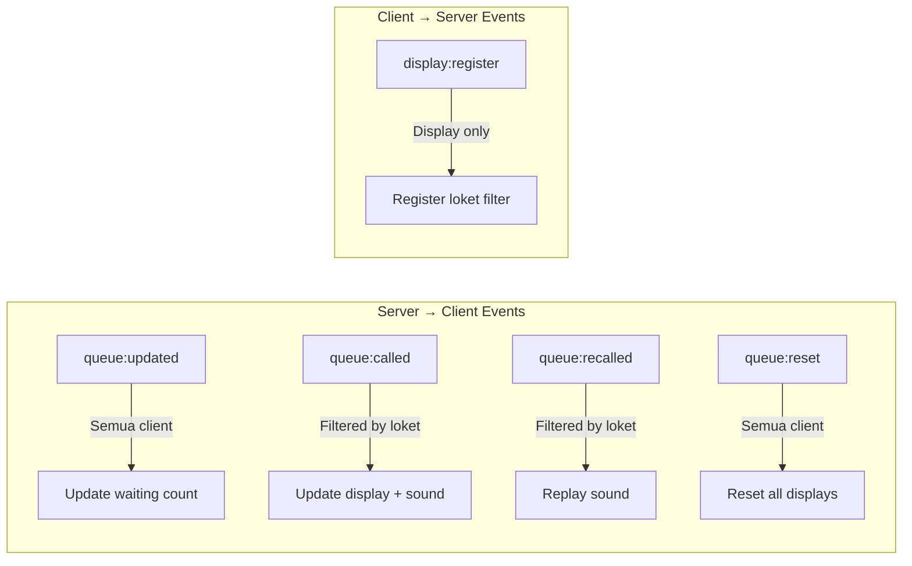

# Design Document: Hospital Queue System

## Overview

Sistem Antrian Rumah Sakit adalah aplikasi web client-server yang berjalan pada jaringan lokal rumah sakit. Sistem ini mengelola antrian pasien dengan tiga jenis halaman utama (Pasien, Admin, Display) yang tersinkronisasi secara real-time melalui WebSocket.

### Keputusan Arsitektur Utama

| Keputusan | Pilihan | Alasan |
|-----------|---------|--------|
| Backend Runtime | Node.js + Express | Ringan, event-driven cocok untuk WebSocket, ekosistem NPM luas |
| Frontend | Vanilla JavaScript + HTML/CSS | Sederhana, tanpa build step, mudah di-deploy di jaringan lokal |
| Database | SQLite (via better-sqlite3) | File-based, zero-config, cocok untuk single-server lokal |
| Real-time | Socket.IO | Abstraksi WebSocket dengan fallback, reconnection built-in |
| Printer | ESC/POS via node-thermal-printer | Standar industri untuk thermal receipt printer |
| Audio | Web Audio API + preloaded audio files | Client-side playback, concatenation via AudioContext |

## Architecture

### Diagram Arsitektur Sistem



### Alur Data Utama



### Struktur Direktori Proyek

```
antrian-rsi2/
├── server/
│   ├── index.js              # Entry point, Express + Socket.IO setup
│   ├── database.js           # SQLite connection & migrations
│   ├── routes/
│   │   ├── queue.js          # Queue operations API
│   │   ├── queueType.js      # Queue type management API
│   │   └── admin.js          # Admin operations (reset, etc.)
│   ├── services/
│   │   ├── queueService.js   # Queue business logic
│   │   ├── queueTypeService.js # Queue type CRUD logic
│   │   └── resetService.js   # Daily reset logic
│   ├── socket/
│   │   └── handler.js        # Socket.IO event handlers
│   └── migrations/
│       └── 001_initial.sql   # Database schema
├── public/
│   ├── patient/
│   │   ├── index.html        # Halaman Pasien
│   │   ├── patient.js        # Logic pengambilan antrian
│   │   └── patient.css       # Styling halaman pasien
│   ├── admin/
│   │   ├── index.html        # Halaman Admin
│   │   ├── admin.js          # Logic admin panel
│   │   └── admin.css         # Styling halaman admin
│   ├── display/
│   │   ├── index.html        # Halaman Display
│   │   ├── display.js        # Logic display + sound engine
│   │   └── display.css       # Styling halaman display
│   ├── shared/
│   │   ├── socket-client.js  # Socket.IO client wrapper
│   │   └── common.css        # Shared styles
│   └── audio/
│       ├── bell.mp3          # Chime pembuka
│       ├── nomor-antrian.mp3 # "Nomor antrian"
│       ├── silakan-menuju.mp3# "Silakan menuju"
│       ├── loket-1.mp3       # "Loket 1"
│       ├── loket-2.mp3       # "Loket 2"
│       ├── 0.mp3 - 9.mp3    # Angka 0-9
│       └── ...               # File audio lainnya
├── package.json
└── README.md
```

## Components and Interfaces

### Backend Components

#### 1. Express HTTP Server (`server/index.js`)

Entry point aplikasi. Menginisialisasi Express, Socket.IO, dan SQLite.

```javascript
// Responsibilities:
// - Serve static files (public/)
// - Mount REST API routes
// - Initialize Socket.IO server
// - Initialize database connection
```

#### 2. Queue Service (`server/services/queueService.js`)

Business logic utama untuk operasi antrian.

```javascript
/**
 * @typedef {Object} QueueNumber
 * @property {number} id
 * @property {string} number - Format: "A-001"
 * @property {number} queueTypeId
 * @property {number|null} loketId
 * @property {'waiting'|'serving'|'done'|'skipped'} status
 * @property {string} createdAt - ISO timestamp
 * @property {string|null} calledAt - ISO timestamp
 */

// Interface:
// takeNumber(queueTypeId: number): QueueNumber
// callNext(queueTypeId: number, loketId: number): QueueNumber | null
// recallCurrent(loketId: number): QueueNumber | null
// getWaitingCount(queueTypeId: number): number
// getCurrentServing(loketId?: number): QueueNumber[]
// getQueueState(): QueueState
```

#### 3. Queue Type Service (`server/services/queueTypeService.js`)

CRUD dan validasi untuk tipe antrian.

```javascript
/**
 * @typedef {Object} QueueType
 * @property {number} id
 * @property {string} name - Max 50 chars
 * @property {string} prefix - 1-3 uppercase alpha chars, unique
 * @property {boolean} isActive
 * @property {boolean} isDefault - Cannot be deleted if true
 */

// Interface:
// getAll(): QueueType[]
// getActive(): QueueType[]
// create(name: string, prefix: string): QueueType
// update(id: number, name: string, prefix: string): QueueType
// deactivate(id: number): void (throws if active queues exist)
// activate(id: number): void
// validate(name: string, prefix: string, excludeId?: number): ValidationResult
```

#### 4. Reset Service (`server/services/resetService.js`)

Logic untuk reset harian dan penyimpanan rekap.

```javascript
/**
 * @typedef {Object} DailyRecap
 * @property {number} id
 * @property {string} date - Format: YYYY-MM-DD
 * @property {Object} summary - {typeId: {total, served, unserved}}
 * @property {string} createdAt
 */

// Interface:
// getResetInfo(): {date: string, totalQueues: number}
// performReset(): DailyRecap (transactional - all or nothing)
```

#### 5. Socket Handler (`server/socket/handler.js`)

Mengelola koneksi WebSocket dan broadcast events.

```javascript
// Events yang di-emit ke client:
// 'queue:updated'  - State antrian berubah (new number taken)
// 'queue:called'   - Antrian dipanggil {number, loketId, loketName, queueType}
// 'queue:recalled' - Antrian dipanggil ulang (same payload as called)
// 'queue:reset'    - Antrian direset

// Events yang diterima dari client:
// 'display:register' - Display mendaftar dengan filter {loketIds: number[]}
```

### Frontend Components

#### 6. Halaman Pasien (`public/patient/`)

Kiosk interface untuk pengambilan nomor antrian.

```javascript
// Responsibilities:
// - Menampilkan tombol per Tipe_Antrian aktif
// - Mengirim request pengambilan nomor
// - Menampilkan nomor antrian yang diambil
// - Trigger pencetakan tiket via browser print API
// - Handle error (printer offline, server error)
```

#### 7. Halaman Admin (`public/admin/`)

Panel kontrol untuk petugas loket.

```javascript
// Responsibilities:
// - Pilih Loket dan Tipe_Antrian
// - Tombol "Panggil Berikutnya"
// - Tombol "Panggil Ulang"
// - Tampilkan nomor sedang dilayani
// - Tampilkan jumlah antrian menunggu per tipe
// - Tombol "Reset Antrian" (admin only)
// - Manajemen Tipe Antrian (CRUD)
```

#### 8. Halaman Display (`public/display/`)

Layar informasi antrian untuk ruang tunggu.

```javascript
// Responsibilities:
// - Parse URL parameter ?loket=1,2 untuk filter
// - Tampilkan nomor yang sedang dilayani per loket (filtered)
// - Tampilkan jumlah antrian tersisa
// - Highlight nomor yang baru dipanggil (5 detik)
// - Putar sound announcement (hanya untuk loket yang di-filter)
// - Tampilkan indikator koneksi terputus
```

#### 9. Sound Engine (`public/display/display.js` - SoundEngine class)

Komponen audio untuk pengumuman suara.

```javascript
/**
 * @class SoundEngine
 * Mengelola pemutaran audio announcement secara berurutan.
 *
 * Alur:
 * 1. Terima event queue:called dengan data {number, loketName}
 * 2. Parse nomor antrian menjadi digit array
 * 3. Bangun sequence file audio: [bell, nomor-antrian, ...digits, silakan-menuju, loket-N]
 * 4. Putar sequence 2x dengan jeda antar pengulangan
 * 5. Jika ada antrian sound berikutnya, putar setelah jeda 1 detik
 */

// Interface:
// announce(queueNumber: string, loketName: string): Promise<void>
// enqueue(announcement: Announcement): void
// isPlaying(): boolean
```

### API Endpoints

| Method | Endpoint | Deskripsi | Request Body | Response |
|--------|----------|-----------|--------------|----------|
| GET | `/api/queue-types` | Daftar semua tipe antrian | - | `QueueType[]` |
| GET | `/api/queue-types/active` | Daftar tipe antrian aktif | - | `QueueType[]` |
| POST | `/api/queue-types` | Tambah tipe antrian baru | `{name, prefix}` | `QueueType` |
| PUT | `/api/queue-types/:id` | Update tipe antrian | `{name, prefix}` | `QueueType` |
| PATCH | `/api/queue-types/:id/activate` | Aktifkan tipe antrian | - | `QueueType` |
| PATCH | `/api/queue-types/:id/deactivate` | Nonaktifkan tipe antrian | - | `QueueType` |
| POST | `/api/queue/take` | Ambil nomor antrian | `{queueTypeId}` | `{number, type, timestamp, waitingAhead}` |
| POST | `/api/queue/call-next` | Panggil antrian berikutnya | `{queueTypeId, loketId}` | `{calledNumber, loketName}` |
| POST | `/api/queue/recall` | Panggil ulang antrian | `{loketId}` | `{calledNumber, loketName}` |
| GET | `/api/queue/state` | Status antrian keseluruhan | - | `QueueState` |
| GET | `/api/queue/waiting-count` | Jumlah antrian menunggu | - | `{typeId: count}` |
| POST | `/api/admin/reset` | Reset antrian harian | `{confirm: true}` | `DailyRecap` |
| GET | `/api/admin/reset-info` | Info sebelum reset | - | `{date, totalQueues}` |
| GET | `/api/admin/recaps` | Daftar rekap harian | - | `DailyRecap[]` |

### WebSocket Events



**Event Payloads:**

```javascript
// queue:updated
{
  queueTypeId: number,
  waitingCount: number,
  totalToday: number
}

// queue:called / queue:recalled
{
  number: string,        // "A-001"
  queueTypeId: number,
  queueTypeName: string, // "Pendaftaran"
  loketId: number,
  loketName: string,     // "Loket 1"
  timestamp: string
}

// queue:reset
{
  date: string,
  resetBy: string
}

// display:register (client → server)
{
  loketIds: number[]     // [1, 2] atau [] untuk semua
}
```

## Data Models

### Database Schema (SQLite)

```sql
-- Tipe Antrian
CREATE TABLE queue_types (
    id INTEGER PRIMARY KEY AUTOINCREMENT,
    name TEXT NOT NULL CHECK(length(name) > 0 AND length(name) <= 50),
    prefix TEXT NOT NULL UNIQUE CHECK(length(prefix) >= 1 AND length(prefix) <= 3 AND prefix GLOB '[A-Z]*'),
    is_active INTEGER NOT NULL DEFAULT 1,
    is_default INTEGER NOT NULL DEFAULT 0,
    created_at TEXT NOT NULL DEFAULT (datetime('now', 'localtime')),
    updated_at TEXT NOT NULL DEFAULT (datetime('now', 'localtime'))
);

-- Loket
CREATE TABLE lokets (
    id INTEGER PRIMARY KEY AUTOINCREMENT,
    name TEXT NOT NULL,          -- "Loket 1", "Loket 2"
    queue_type_id INTEGER,       -- Tipe antrian yang dilayani
    is_active INTEGER NOT NULL DEFAULT 1,
    FOREIGN KEY (queue_type_id) REFERENCES queue_types(id)
);

-- Nomor Antrian (data harian, direset setiap hari)
CREATE TABLE queue_numbers (
    id INTEGER PRIMARY KEY AUTOINCREMENT,
    number TEXT NOT NULL,         -- "A-001"
    sequence INTEGER NOT NULL,   -- 1, 2, 3, ...
    queue_type_id INTEGER NOT NULL,
    loket_id INTEGER,            -- NULL saat menunggu, diisi saat dipanggil
    status TEXT NOT NULL DEFAULT 'waiting' CHECK(status IN ('waiting', 'serving', 'done', 'skipped')),
    date TEXT NOT NULL DEFAULT (date('now', 'localtime')),
    created_at TEXT NOT NULL DEFAULT (datetime('now', 'localtime')),
    called_at TEXT,
    completed_at TEXT,
    FOREIGN KEY (queue_type_id) REFERENCES queue_types(id),
    FOREIGN KEY (loket_id) REFERENCES lokets(id)
);

-- Counter harian (untuk atomic increment)
CREATE TABLE daily_counters (
    id INTEGER PRIMARY KEY AUTOINCREMENT,
    queue_type_id INTEGER NOT NULL,
    date TEXT NOT NULL DEFAULT (date('now', 'localtime')),
    last_number INTEGER NOT NULL DEFAULT 0,
    UNIQUE(queue_type_id, date),
    FOREIGN KEY (queue_type_id) REFERENCES queue_types(id)
);

-- Rekap Harian
CREATE TABLE daily_recaps (
    id INTEGER PRIMARY KEY AUTOINCREMENT,
    date TEXT NOT NULL UNIQUE,
    summary TEXT NOT NULL,        -- JSON: {typeId: {name, total, served, unserved}}
    created_at TEXT NOT NULL DEFAULT (datetime('now', 'localtime'))
);

-- Indexes
CREATE INDEX idx_queue_numbers_status ON queue_numbers(status, date);
CREATE INDEX idx_queue_numbers_type_date ON queue_numbers(queue_type_id, date);
CREATE INDEX idx_daily_counters_type_date ON daily_counters(queue_type_id, date);
```

### Default Data

```sql
INSERT INTO queue_types (name, prefix, is_active, is_default) VALUES
    ('Pendaftaran', 'A', 1, 1),
    ('Kasir', 'B', 1, 1),
    ('Farmasi', 'C', 1, 1),
    ('Fast Track', 'D', 1, 1);

INSERT INTO lokets (name, queue_type_id, is_active) VALUES
    ('Loket 1', 1, 1),
    ('Loket 2', 1, 1),
    ('Loket 3', 2, 1),
    ('Loket 4', 3, 1),
    ('Loket 5', 4, 1);
```

### Mekanisme Atomic Counter

Untuk menjamin keunikan nomor antrian pada akses bersamaan (Requirement 1.7), digunakan mekanisme berikut:

```javascript
// server/services/queueService.js
function takeNumber(queueTypeId) {
  // SQLite serializes writes by default (WAL mode)
  // Gunakan transaction untuk atomic read-increment-insert
  const stmt = db.transaction(() => {
    const today = getToday(); // YYYY-MM-DD

    // Atomic increment counter
    db.prepare(`
      INSERT INTO daily_counters (queue_type_id, date, last_number)
      VALUES (?, ?, 1)
      ON CONFLICT(queue_type_id, date)
      DO UPDATE SET last_number = last_number + 1
    `).run(queueTypeId, today);

    // Get the new number
    const counter = db.prepare(`
      SELECT last_number FROM daily_counters
      WHERE queue_type_id = ? AND date = ?
    `).get(queueTypeId, today);

    const queueType = db.prepare(`SELECT * FROM queue_types WHERE id = ?`).get(queueTypeId);
    const number = `${queueType.prefix}-${String(counter.last_number).padStart(3, '0')}`;

    // Insert queue number
    const result = db.prepare(`
      INSERT INTO queue_numbers (number, sequence, queue_type_id, date)
      VALUES (?, ?, ?, ?)
    `).run(number, counter.last_number, queueTypeId, today);

    return { id: result.lastInsertRowid, number, queueType, sequence: counter.last_number };
  });

  return stmt();
}
```

### Sound Engine - Algoritma Konstruksi Audio

```javascript
// public/display/display.js
class SoundEngine {
  constructor(audioBasePath = '/audio') {
    this.basePath = audioBasePath;
    this.queue = [];        // FIFO queue untuk announcements
    this.isPlaying = false;
    this.audioCache = {};   // Pre-loaded audio buffers
  }

  /**
   * Membangun sequence file audio dari nomor antrian.
   * Contoh: "A-003" di "Loket 1" →
   *   [bell, nomor-antrian, 0, 0, 3, silakan-menuju, loket-1]
   *
   * @param {string} queueNumber - e.g. "A-003"
   * @param {string} loketName - e.g. "Loket 1"
   * @returns {string[]} Array of audio file paths
   */
  buildAudioSequence(queueNumber, loketName) {
    const parts = ['bell.mp3', 'nomor-antrian.mp3'];

    // Parse digits from number part (after prefix-)
    const numberPart = queueNumber.split('-')[1]; // "003"
    for (const digit of numberPart) {
      parts.push(`${digit}.mp3`);
    }

    parts.push('silakan-menuju.mp3');

    // Normalize loket name to filename
    const loketFile = loketName.toLowerCase().replace(/\s+/g, '-') + '.mp3';
    parts.push(loketFile);

    return parts;
  }

  /**
   * Memutar announcement. Diputar 2x per panggilan.
   * Jika ada announcement lain dalam queue, putar setelah jeda 1 detik.
   */
  async announce(queueNumber, loketName) {
    const sequence = this.buildAudioSequence(queueNumber, loketName);
    // Repeat 2x
    this.enqueue({ sequence, repeats: 2 });
  }
}
```

### Printer Integration - Pendekatan Desain

Pencetakan tiket menggunakan pendekatan **server-side ESC/POS** melalui library `node-thermal-printer`:

```javascript
// server/services/printerService.js
const ThermalPrinter = require('node-thermal-printer').printer;
const PrinterTypes = require('node-thermal-printer').types;

/**
 * Format tiket:
 * ================================
 *        RSI MUHAMMADIYAH 2
 *           KENDAL
 * ================================
 *
 *          [NOMOR BESAR]
 *            A - 001
 *
 * Tipe    : Pendaftaran
 * Tanggal : 15/01/2025 08:30
 * Antrian di depan Anda: 5
 * ================================
 *    Terima kasih, mohon menunggu
 * ================================
 */

// Interface:
// printTicket(ticketData: TicketData): Promise<PrintResult>
// checkPrinterStatus(): Promise<{connected: boolean, error?: string}>
// reprintTicket(queueNumberId: number): Promise<PrintResult>
```

**Alternatif fallback**: Jika printer tidak terdeteksi di server, sistem menggunakan browser `window.print()` dengan CSS `@media print` yang diformat khusus untuk thermal paper (width: 80mm).

### Display Filter - Mekanisme URL Parameter

```javascript
// public/display/display.js

/**
 * Parse URL parameter untuk filter loket.
 * Contoh URL:
 *   /display/?loket=1       → Tampilkan hanya Loket 1
 *   /display/?loket=1,2     → Tampilkan Loket 1 dan 2
 *   /display/               → Tampilkan semua loket (no filter)
 *
 * @returns {number[]} Array of loket IDs, empty = show all
 */
function parseDisplayFilter() {
  const params = new URLSearchParams(window.location.search);
  const loketParam = params.get('loket');

  if (!loketParam || loketParam.trim() === '') {
    return []; // Show all
  }

  return loketParam
    .split(',')
    .map(id => parseInt(id.trim(), 10))
    .filter(id => !isNaN(id) && id > 0);
}

/**
 * Menentukan apakah event queue:called harus diproses oleh display ini.
 * @param {Object} event - Event data dari socket
 * @param {number[]} filter - Loket IDs yang ditampilkan
 * @returns {boolean}
 */
function shouldProcessEvent(event, filter) {
  if (filter.length === 0) return true; // No filter = process all
  return filter.includes(event.loketId);
}
```

### Reconnection Strategy

```javascript
// public/shared/socket-client.js

/**
 * Socket.IO client wrapper dengan reconnection strategy sesuai Requirement 6.
 *
 * Fase 1: Reconnect cepat
 *   - Interval: 3 detik
 *   - Maksimal: 10 percobaan (30 detik)
 *
 * Fase 2: Reconnect lambat (setelah 10 gagal)
 *   - Interval: 10 detik
 *   - Terus mencoba hingga berhasil
 *   - Tampilkan indikator "koneksi terputus"
 *
 * Setelah reconnect berhasil:
 *   - Request full state sync dari server
 *   - Hilangkan indikator koneksi terputus
 */
const socketConfig = {
  reconnection: true,
  reconnectionAttempts: 10,
  reconnectionDelay: 3000,
  reconnectionDelayMax: 3000,
  timeout: 5000
};
```

## Correctness Properties

*A property is a characteristic or behavior that should hold true across all valid executions of a system — essentially, a formal statement about what the system should do. Properties serve as the bridge between human-readable specifications and machine-verifiable correctness guarantees.*

### Property 1: Format Nomor Antrian

*For any* tipe antrian dengan prefix P (1-3 karakter uppercase) dan counter N (1-999), nomor antrian yang dihasilkan harus selalu berformat `P-NNN` di mana NNN adalah representasi 3 digit zero-padded dari N.

**Validates: Requirements 1.1**

### Property 2: Hanya Tipe Antrian Aktif yang Ditampilkan

*For any* kumpulan tipe antrian dengan status aktif/nonaktif yang bervariasi, daftar yang ditampilkan pada Halaman Pasien harus berisi tepat semua tipe antrian yang berstatus aktif dan tidak berisi satupun tipe antrian yang berstatus nonaktif.

**Validates: Requirements 1.3, 5.3**

### Property 3: Urutan FIFO pada Daftar Tunggu

*For any* urutan pengambilan nomor antrian pada tipe yang sama, setiap nomor baru selalu ditempatkan di posisi terakhir daftar tunggu, dan pemanggilan selalu mengambil nomor dari posisi paling awal (FIFO).

**Validates: Requirements 1.4, 2.1**

### Property 4: Keunikan Nomor Antrian pada Akses Bersamaan

*For any* jumlah request pengambilan nomor antrian yang dilakukan secara bersamaan pada tipe antrian yang sama, semua nomor yang dihasilkan harus unik dan membentuk urutan berurutan tanpa celah (contiguous sequence).

**Validates: Requirements 1.7**

### Property 5: Konsistensi Jumlah Antrian Menunggu

*For any* urutan operasi penambahan dan pemanggilan antrian pada suatu tipe, jumlah antrian menunggu yang ditampilkan harus selalu sama dengan (jumlah nomor yang diambil - jumlah nomor yang dipanggil) untuk tipe tersebut pada hari yang sama.

**Validates: Requirements 2.4**

### Property 6: Display Filter Menampilkan Hanya Loket yang Sesuai

*For any* konfigurasi URL parameter loket dan state antrian, Halaman Display harus menampilkan hanya informasi antrian yang terkait dengan loket yang tercantum dalam filter. Jika filter kosong, semua loket aktif ditampilkan.

**Validates: Requirements 3.7, 3.8, 3.9**

### Property 7: Sound Routing Berdasarkan Display Filter

*For any* event pemanggilan antrian pada loket tertentu dan kumpulan instance display dengan filter berbeda, pengumuman suara hanya diputar pada instance display yang filter-nya mencakup loket tersebut.

**Validates: Requirements 3.10**

### Property 8: Konstruksi Sequence Audio

*For any* nomor antrian valid (format PREFIX-NNN) dan nama loket, sequence audio yang dibangun harus selalu mengandung: [bell, nomor-antrian, digit1, digit2, digit3, silakan-menuju, loket-name], dan sequence ini diputar tepat 2 kali per panggilan.

**Validates: Requirements 4.1**

### Property 9: Antrian Sound FIFO

*For any* urutan panggilan antrian yang terjadi bersamaan, Sound Engine harus memproses dan memutar pengumuman dalam urutan FIFO yang sama dengan urutan kedatangan event.

**Validates: Requirements 4.5**

### Property 10: Validasi Tipe Antrian

*For any* input nama dan kode prefix untuk tipe antrian baru, sistem harus menerima input jika dan hanya jika: nama tidak kosong (panjang 1-50 karakter), prefix terdiri dari 1-3 karakter alfabet uppercase, dan prefix belum digunakan oleh tipe antrian lain.

**Validates: Requirements 5.1, 5.5, 5.7**

### Property 11: Penolakan Penonaktifan Tipe dengan Antrian Aktif

*For any* tipe antrian yang memiliki satu atau lebih nomor antrian dengan status 'waiting' atau 'serving' pada hari tersebut, percobaan penonaktifan harus selalu ditolak dan state tipe antrian tetap aktif.

**Validates: Requirements 5.4**

### Property 12: Modifikasi Tipe Antrian Mempertahankan Antrian Existing

*For any* tipe antrian yang memiliki nomor antrian aktif, perubahan konfigurasi (nama, prefix) tidak boleh mengubah nomor antrian yang sudah diterbitkan — urutan, status, dan format nomor tetap sama.

**Validates: Requirements 5.2**

### Property 13: Reset Menghasilkan Rekap yang Akurat

*For any* state antrian pada suatu hari, setelah reset dilakukan, rekap yang disimpan harus berisi: tanggal yang benar, jumlah total antrian per tipe yang sama dengan data sebelum reset, jumlah yang dilayani, dan jumlah yang belum dilayani — dan setelah reset semua counter kembali ke nol.

**Validates: Requirements 7.2, 7.3**

### Property 14: Atomicity Reset (All-or-Nothing)

*For any* state antrian, jika proses reset gagal di tengah jalan (misalnya gagal menyimpan rekap), maka seluruh state antrian harus tetap tidak berubah — tidak ada data yang hilang atau ter-reset sebagian.

**Validates: Requirements 7.5**

### Property 15: Kelengkapan Informasi Tiket

*For any* nomor antrian yang berhasil dibuat, konten tiket yang dihasilkan harus selalu mengandung: nomor antrian, nama tipe antrian, tanggal dan waktu pengambilan, serta jumlah antrian yang menunggu di depan pasien pada saat pengambilan.

**Validates: Requirements 8.2**

## Error Handling

### Strategi Error Handling per Layer

| Layer | Jenis Error | Penanganan |
|-------|-------------|------------|
| Database | Connection lost | Retry 3x, lalu return 503 |
| Database | Constraint violation | Return 400 dengan pesan spesifik |
| Database | Transaction failure | Rollback, return 500 |
| WebSocket | Client disconnect | Auto-reconnect (client-side) |
| WebSocket | Server broadcast fail | Log error, skip client |
| Printer | Not connected | Simpan antrian, tampilkan warning |
| Printer | Print failure | Tampilkan error + opsi reprint |
| Audio | File not found | Skip audio, visual tetap berjalan |
| Audio | Playback failure | Log error, lanjut ke announcement berikutnya |
| API | Invalid input | Return 400 dengan validation errors |
| API | Not found | Return 404 |
| API | Concurrent conflict | SQLite handles via WAL mode |

### Error Response Format

```javascript
// Semua API error menggunakan format konsisten:
{
  "success": false,
  "error": {
    "code": "QUEUE_TYPE_HAS_ACTIVE",  // Machine-readable error code
    "message": "Tidak dapat menonaktifkan tipe antrian yang masih memiliki 5 antrian aktif",
    "details": {                       // Optional additional context
      "activeCount": 5,
      "queueTypeId": 1
    }
  }
}
```

### Error Codes

| Code | HTTP Status | Deskripsi |
|------|-------------|-----------|
| `VALIDATION_ERROR` | 400 | Input tidak valid |
| `PREFIX_DUPLICATE` | 400 | Kode prefix sudah digunakan |
| `QUEUE_TYPE_HAS_ACTIVE` | 400 | Tipe antrian masih memiliki antrian aktif |
| `QUEUE_EMPTY` | 404 | Tidak ada antrian menunggu |
| `NO_ACTIVE_SERVING` | 404 | Tidak ada antrian yang sedang dilayani |
| `QUEUE_TYPE_NOT_FOUND` | 404 | Tipe antrian tidak ditemukan |
| `CANNOT_DELETE_DEFAULT` | 403 | Tipe antrian default tidak dapat dihapus |
| `RESET_FAILED` | 500 | Gagal melakukan reset (rollback) |
| `PRINTER_OFFLINE` | 503 | Printer tidak terhubung |
| `PRINTER_ERROR` | 500 | Gagal mencetak (kertas habis, dll) |

## Testing Strategy

### Pendekatan Dual Testing

Sistem ini menggunakan kombinasi **unit tests** dan **property-based tests** untuk cakupan pengujian yang komprehensif.

### Unit Tests (Example-Based)

Framework: **Jest**

Fokus pada:
- Specific examples dan edge cases
- Integration points antar komponen
- Error handling scenarios
- UI behavior (dengan jsdom)

Contoh test cases:
- Pemanggilan pada antrian kosong menampilkan pesan yang benar
- Tombol "Panggil Ulang" disabled saat tidak ada antrian aktif
- Reconnection mengikuti pola yang ditentukan (3s × 10, lalu 10s)
- Reset menampilkan dialog konfirmasi dengan info yang benar
- Printer offline tidak memblokir pengambilan nomor antrian

### Property-Based Tests

Framework: **fast-check**

Konfigurasi:
- Minimum **100 iterasi** per property test
- Setiap test di-tag dengan referensi ke design property

```javascript
// Contoh tag format:
// Feature: hospital-queue-system, Property 1: Format Nomor Antrian

const fc = require('fast-check');

describe('Queue Number Generation', () => {
  it('Property 1: Format Nomor Antrian', () => {
    fc.assert(
      fc.property(
        fc.string({ minLength: 1, maxLength: 3 }).filter(s => /^[A-Z]+$/.test(s)),
        fc.integer({ min: 1, max: 999 }),
        (prefix, counter) => {
          const result = formatQueueNumber(prefix, counter);
          const expected = `${prefix}-${String(counter).padStart(3, '0')}`;
          return result === expected;
        }
      ),
      { numRuns: 100 }
    );
  });
});
```

### Property Tests Coverage Map

| Property | Test File | Deskripsi |
|----------|-----------|-----------|
| Property 1 | `queue-number.property.test.js` | Format nomor antrian |
| Property 2 | `queue-type-filter.property.test.js` | Filter tipe aktif |
| Property 3 | `queue-fifo.property.test.js` | Urutan FIFO |
| Property 4 | `queue-concurrency.property.test.js` | Keunikan concurrent |
| Property 5 | `queue-count.property.test.js` | Konsistensi jumlah |
| Property 6 | `display-filter.property.test.js` | Display filter |
| Property 7 | `sound-routing.property.test.js` | Sound routing |
| Property 8 | `audio-sequence.property.test.js` | Konstruksi audio |
| Property 9 | `sound-queue.property.test.js` | Sound FIFO |
| Property 10 | `queue-type-validation.property.test.js` | Validasi input |
| Property 11 | `queue-type-deactivation.property.test.js` | Penolakan deaktivasi |
| Property 12 | `queue-type-modification.property.test.js` | Preservasi antrian |
| Property 13 | `reset-recap.property.test.js` | Akurasi rekap |
| Property 14 | `reset-atomicity.property.test.js` | Atomicity reset |
| Property 15 | `ticket-content.property.test.js` | Kelengkapan tiket |

### Integration Tests

Framework: **Jest** + **supertest** (HTTP) + **socket.io-client** (WebSocket)

Fokus pada:
- End-to-end flow: ambil nomor → panggil → display update
- WebSocket broadcast ke multiple clients
- Reconnection dan state sync setelah disconnect
- Printer communication (mocked)
- Database transaction integrity

### Test Execution

```bash
# Unit + Property tests
npm test

# Integration tests
npm run test:integration

# Semua tests
npm run test:all
```
